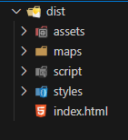
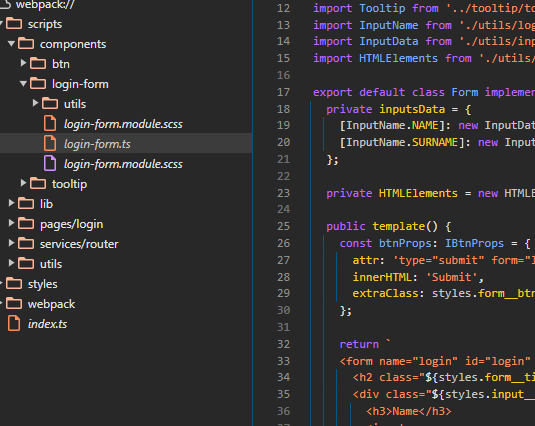
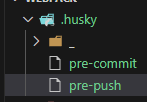
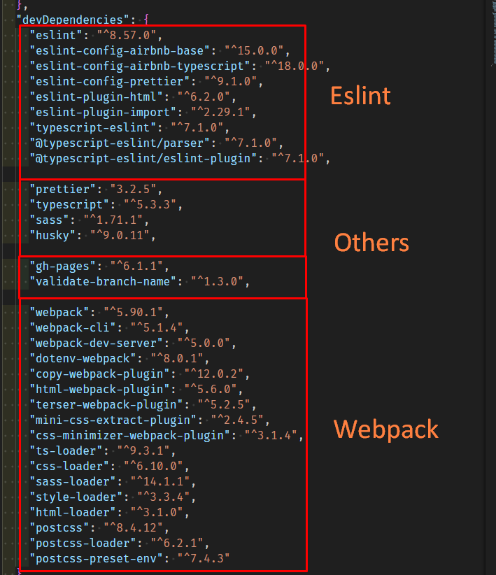

## Webpack & Eslint

#### 1) Webpack

**1.1) Commands**

  ```json
    "dev": "webpack --env mode=development",
    "build": "webpack --env mode=production",
    "start": "webpack serve --open --env mode=development",
    "continue": "webpack serve --env mode=development",
  ```
-  `env` встроенная переменная, работает если в конфиге используем функцию `module.exports = (env) => {{config object}}`, которая первым аргументом принимает объект env
- `npm run dev` - Генерирует `dist` в режиме `development`
- `npm run build` - Генерирует `dist` в режиме `production`
- `npm run start` - Запускает `devServer` и открывает в браузере страницу
- `npm run dev` - Запускает `devServer` без открытия страницы, если она уже открыта в браузере

**1.2) Config**

- `devtool: "source-map" | false | etc`
Генерирует **source map** для сайта, которые позволяют дебажить и в принципе просматривать код даже с отсутствием рабочего кода в **src**.





- **CopyWebpackPlugin** просто копирует выбранные файлы. Вебпак скопирует только то, что используется в коде. А бывает надо переключаться между картинками с помощью js. Можно конечно просто всё экспортировать в js или закинуть на облако...

- **declaration.d.ts** в `src/declaration.d.ts` нужен, чтобы модули не ругались в **TS**

#### 2) Eslint

**2.1) Commands**
```json
    "lint": "npx eslint src/ --ext .js,.ts --color",
    "lint:fix": "npm run lint -- --fix --color",
    "prettier": "npx prettier src/ --check",
    "prettier:fix": "npm run prettier -- --write",
    "format": "npm run lint:fix && npm run prettier:fix",
    "ci:format": "npm run lint && npm run prettier",
```
- `npm run format` - исправляет все недочёты
- `npm run ci:format`- проверяет все недочёты


**2.2) Config**

- Сначала работает встроенный **Prettier**, затем **Eslint**
[Гайд взял отсюда](https://blog.logrocket.com/using-prettier-eslint-automate-formatting-fixing-javascript/)
Достаточно исключить правила `prettier` и добавить это в настройках 
(`CTRL + ,` Открыть настройки JSON в правом верхнем углу)

  ```js
   "editor.formatOnSave": false,
   //  Runs Prettier, then ESLint
   "editor.codeActionsOnSave": [
     "source.formatDocument",
     "source.fixAll.eslint"
   ],
   ```

- `"parser": "@typescript-eslint/parser"`
Чтобы работал **Eslint** в **TS**

- `"project": ["./tsconfig.json"]` в `parserOptions`
Брал дополнительные проверки с **tsconfig**

#### 4) Husky

- В этих файлах прописывать команды, которые будут происходить на соответствующий названию хук. 
Можно ещё в таких же файлах в папке `_` прописать на неизвестном мне языке свой функционал проверки.




#### 3) Screenshots


